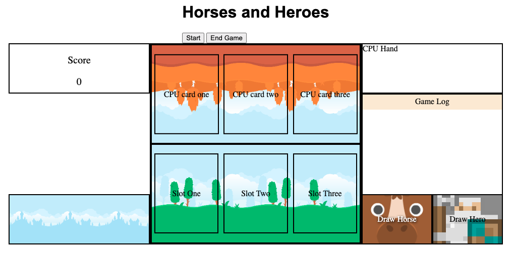

# Horses and Heroes
This was made in homage to the game [Inscryption](https://www.devolverdigital.com/games/inscryption) by Devolver Digital.

**How to Play**  
Play horses, then mount heroes on them to build your army. Attack empty spaces on your opponent's side of the board to score points based on your card's attack power. Get the score meter up to 5 to win.

# Screenshots

# Technologies Used
- JavaScript (vanilla)
- HTML
- CSS

# Getting Started
This game is playable at GitHub Pages: https://steviec7.github.io/project-one/

## Game Flow
1. Decks shuffled and set for play
2. Players draw their hands
3. Play phase
    - (except first turn) Player draws either a horse or a hero card. The horse deck is an unlimited supply.
    - Player may play as many cards in one turn as there are available spots on their side of the board.
    - Player may play a horse into an empty spot. Horses are weak, but necessary to play heroes.
    - Player may play a hero onto a horse, but not onto an empty spot. If played onto horse, the mounted horse is removed from play.
4. Fight phase
    - Player's cards are compared against CPU's, one by one
    - The cards' attack powers reduce their opposing card's health
    - If a card loses all health, it is discarded
    - If a card opposes an empty spot, its attack power is applied against the player/cpu score meter. Human player attacks on the CPU player generate positive points. CPU attacks on the human player generate negative points.
5. Repeat play phase and fight phase until a player wins.
    - When the fully resolved total of all of a turn's card attacks causes the score meter to cross either win threshold, the game ends and displays the result screen with a "Play Again" button.

# Next Steps
- Update CPU artifical intelligence so that it plays cards more effectively. This creates opportunity for multiple difficulty levels available to user.
- Add animations:
    - Card inspector
    - Draw card
    - Place card
    - Fight phase
- Add UI highlighting to make valid moves apparent to player
- Adjust timing of events so that everything is rendered in a way that players can follow.
- Make responsive layout for mobile/tablets.